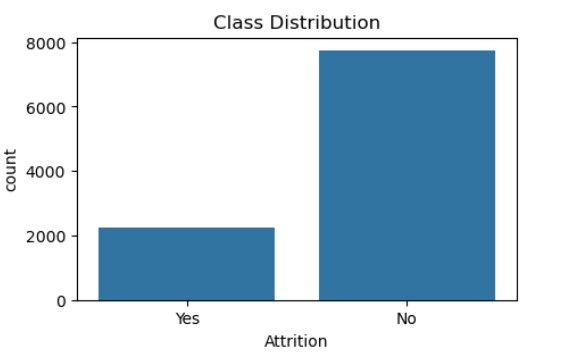
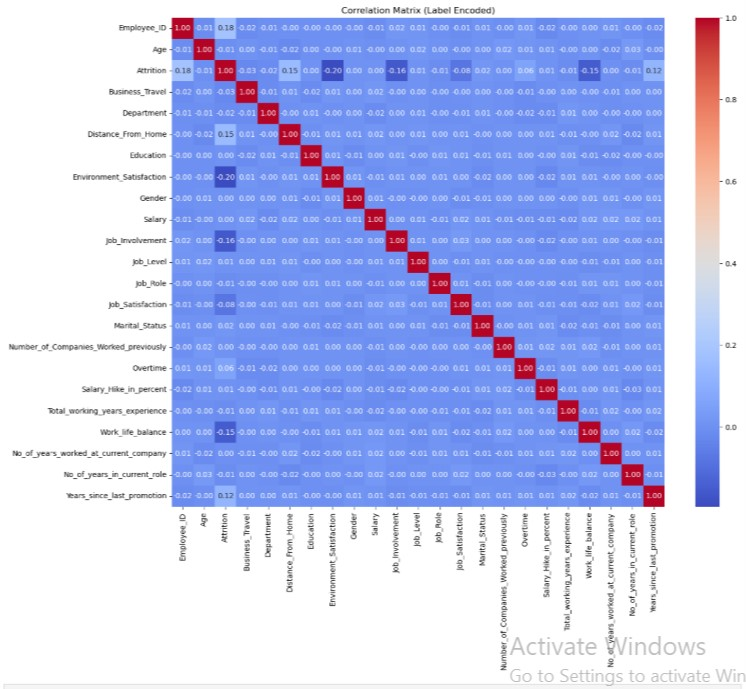

#  HR Attrition Prediction

##  Dataset Overview

**Source:** [Kaggle - HR Attrition Dataset](https://www.kaggle.com/datasets/ankitrajmishra/hr-attrition-dataset)

Employee attrition is a critical issue faced by organizations, especially in competitive industries like IT and services. Losing employees not only affects productivity but also increases costs related to hiring, training, and onboarding.

---

## 🧾 Column Descriptions

| Column Name                             | Description                                                                 |
|-----------------------------------------|-----------------------------------------------------------------------------|
| `Employee_ID`                           | Unique identifier assigned to each employee.                                |
| `Age`                                   | Employee's age.                                                             |
| `Attrition`                             | Whether the employee has left the company (`Yes`/`No`).                     |
| `Business_Travel`                       | Frequency or type of business travel.                                       |
| `Department`                            | Department where the employee works.                                        |
| `Distance_From_Home`                    | Distance between the employee's home and workplace.                         |
| `Education`                             | Employee's education level.                                                 |
| `Environment_Satisfaction`              | Rating of work environment satisfaction (1 = Low, 5 = High).                |
| `Gender`                                | Gender of the employee.                                                     |
| `Salary`                                | Employee’s salary.                                                          |
| `Job_Involvement`                       | Manager’s rating of job involvement (1 to 5).                               |
| `Job_Level`                             | Job level within the company (1 = Lowest, 8 = Highest).                     |
| `Job_Role`                              | Specific role (e.g., HR, Developer, Manager, Technician, etc.).             |
| `Job_Satisfaction`                      | Employee’s job satisfaction rating (1 to 5).                                |
| `Marital_Status`                        | Employee's marital status.                                                  |
| `Number_of_Companies_Worked_Previously` | Total number of companies previously worked for.                            |
| `Overtime`                              | Indicates if the employee works overtime (`Yes`/`No`).                      |
| `Salary_Hike_in_Percent`                | Percentage increase in salary.                                              |
| `Total_Working_Years_Experience`        | Total working experience across all jobs.                                   |
| `Work_Life_Balance`                     | Self-rating of work-life balance (1 to 5).                                  |
| `No_of_Years_Worked_at_Current_Company` | Total years at the current company.                                         |
| `No_of_Years_in_Current_Role`           | Total years in the current role.                                            |
| `Years_Since_Last_Promotion`            | Number of years since the last promotion.                                   |

-----
##  Goal: Predicting Employee Attrition

The objective of this project is to build a machine learning model that can accurately **predict whether an employee is likely to leave the company** (Attrition = `Yes`) or stay (Attrition = `No`).

Understanding employee attrition allows HR teams to proactively address workplace issues, improve employee satisfaction, and reduce turnover costs.

Below is the class distribution of the target variable `Attrition`:

##  Categorical Feature Distribution by Attrition

To gain deeper insights into the factors influencing employee attrition, we examined the distribution of various **categorical features** across the two attrition classes (`Yes` and `No`).

The following plots show how different categories such as `Business_Travel`, `Department`, `Gender`, `Marital_Status`, and `Overtime` vary between employees who left the company and those who stayed:

- **Business Travel**: Employees who travel frequently or rarely show different attrition patterns.
- **Department**: Attrition rates vary across departments like Software Development, IT Services, and Cyber Security.
- **Gender**: Male and female employees exhibit similar attrition distributions.
- **Marital Status**: Single employees tend to have higher attrition than married ones.
- **Overtime**: Employees who work overtime are more likely to leave.

##  Outlier Detection in Numerical Features

To ensure data quality and model robustness, we analyzed the **numerical features** for outliers using **boxplots**.

The following features were checked:

- **Age**
- **Salary**
- **Salary_Hike_in_percent**

**Result:** No outliers were detected in any of these features, as all data points fall within the whiskers of the boxplots.

##  Correlation Matrix (Label Encoded Features)

To explore relationships between features, we generated a **correlation heatmap** using label-encoded data.

- **Observation:** Most features show **very weak or no correlation** with each other, including with the target variable `Attrition`.
- The matrix helps identify redundancy or multicollinearity among features before modeling.

> Color scale:
> - 🔴 Red = Strong Positive Correlation
> - 🔵 Blue = Weak/Negative Correlation
> - ⚪ White = No Correlation

--------------
##  Model Performance Comparison

| Metric / Model              | Logistic Regression | Decision Tree | Random Forest | Gradient Boosting | Naive Bayes |
|-----------------------------|---------------------|----------------|----------------|--------------------|-------------|
| **Training Accuracy**       | 0.8065              | 1.0000         | 1.0000         | 0.8808             | 0.8110      |
| **Validation Accuracy**     | 0.7910              | 0.7850         | 0.8470         | **0.8655**         | 0.8020      |
| **Test Accuracy**           | 0.8045              | 0.7955         | 0.8535         | **0.8740**         | 0.8100      |
| **Test Precision (Yes)**    | 0.68                | 0.54           | 0.97           | **0.94**           | 0.74        |
| **Test Recall (Yes)**       | 0.24                | 0.55           | 0.36           | **0.47**           | 0.23        |
| **Test F1-score (Yes)**     | 0.36                | 0.55           | 0.52           | **0.62**           | 0.36        |
| **Macro F1-score (Test)**   | 0.62                | 0.71           | 0.72           | **0.77**           | 0.62        |

---

##  Model Selection: Why We Chose Gradient Boosting

After evaluating several classification models, we selected **Gradient Boosting** as the final deployed model due to the following reasons:

- **Highest test accuracy** among all models (87.4%)
- **Best balance** between precision and recall for the minority class `Attrition = Yes`
- **Highest F1-score (Yes)**: Indicates better ability to detect actual attrition cases
- **No overfitting**: Unlike Decision Tree and Random Forest (which had 100% training accuracy), Gradient Boosting maintained good generalization
-  **Macro F1-score of 0.77**, showing strong overall performance across both classes

This makes Gradient Boosting the most reliable model for predicting employee attrition in a balanced and interpretable way.

